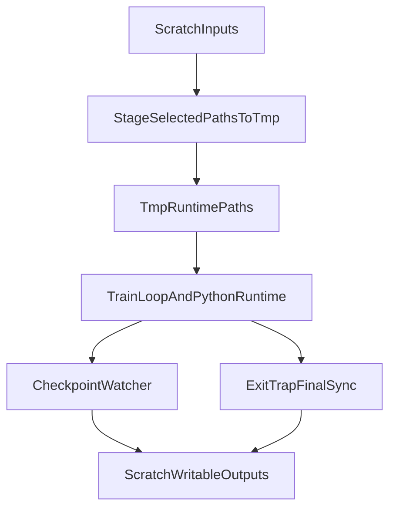

# Configurable /tmp Staging Plan

## Goal
Move the runtime-critical read/write paths used by [train_loop_dp_gms_resume_4.sh](/scratch/498rustam/cad_refine_m/train_loop_dp_gms_resume_4.sh) onto `/tmp`, while keeping the list of staged paths and sync-back targets editable from that top-level script.

## Current State
The train loop currently hard-codes scratch paths for the main output, checkpoint source, resume checkpoint, logs, config, and launch script:

```25:38:/scratch/498rustam/cad_refine_m/train_loop_dp_gms_resume_4.sh
CUDA_VISIBLE_DEVICES=0 trl vllm-serve \
  --model Qwen/Qwen2-VL-2B-Instruct \
  --max_model_len 3600 \
  >"$VLLM_LOG" 2>&1 &
sleep 80
script --flush -c \
  "COMET_API_KEY=${COMET_API_KEY} COMET_PROJECT_NAME=${COMET_PROJECT_NAME} COMET_WORKSPACE=${COMET_WORKSPACE} \
  CUDA_VISIBLE_DEVICES=1,2,3 PYTORCH_CUDA_ALLOC_CONF=expandable_segments:True \
  accelerate launch ${LAUNCH_SCRIPT} --config ${CONFIG_FILE} \
  --output_dir ${BASE_DIR} --run_name ${RUN_NAME} --sft_path ${CHECKPOINT} \
  --resume_ckpt_path ${RESUME} --save_total_limit ${SAVE_TOTAL_LIMIT}" \
  "$LOG_FILE"
```

The existing helper in [slurm_scripts/copy_paster.sh](/scratch/498rustam/cad_refine_m/slurm_scripts/copy_paster.sh) duplicates those variables and copies only a subset of paths, without actually running training against `/tmp` paths:

```25:35:/scratch/498rustam/cad_refine_m/slurm_scripts/copy_paster.sh
mkdir -p "/tmp/superustam_daily"

cp -r "${BASE_DIR}" "/tmp/superustam_daily/$(basename "${BASE_DIR}")"
cp -r "${CHECKPOINT}" "/tmp/superustam_daily/$(basename "${CHECKPOINT}")"
cp -r "${RESUME}" "/tmp/superustam_daily/$(basename "${RESUME}")"
```

The access analysis in [docs/file_access.md](/scratch/498rustam/cad_refine_m/docs/file_access.md) also shows downstream dataset and HF cache paths that should be considered part of the staging design.

## Implementation Approach
1. Turn [train_loop_dp_gms_resume_4.sh](/scratch/498rustam/cad_refine_m/train_loop_dp_gms_resume_4.sh) into the single source of truth.
Add editable variables near the top of the script for:
- `TMP_ROOT`
- booleans or path lists for staging read-heavy inputs: `CHECKPOINT`, `RESUME`, dataset path, HF cache root
- booleans or path lists for writable sync-back targets: `BASE_DIR`, logs, any tmp-backed cache/output dirs worth preserving
- sync policy knobs: enable/disable periodic sync, checkpoint polling interval, final sync on exit

2. Add path staging helpers inside the train loop.
Implement small shell functions such as `stage_path_to_tmp`, `stage_dir_if_enabled`, and `sync_back_dir_if_enabled` so the script can:
- copy selected source paths from scratch to `/tmp`
- rewrite runtime variables to point at the staged `/tmp` copies
- keep the logic declarative instead of repeating `cp -r` blocks

3. Make downstream Python read dataset/cache locations from the shell-controlled runtime.
Update [rl_train_cos_sched.py](/scratch/498rustam/cad_refine_m/rl_train_cos_sched.py) so the dataset path is no longer locked to scratch constants only. Preferred approach:
- add an environment override like `HF_DATASET_OVERRIDE`
- keep the current default branch logic as fallback when the override is unset
- optionally honor `HF_HOME` or related cache env vars directly from the shell script rather than hard-coding extra Python flags

4. Run training entirely against staged paths.
Before starting vLLM and `accelerate`, stage enabled inputs to `/tmp` and then replace the runtime values used in the launch command:
- `BASE_DIR` becomes tmp-backed writable output
- `CHECKPOINT` and `RESUME` become tmp-backed readonly inputs
- dataset/cache env vars point to tmp-backed locations
- logs can either stay on scratch or be made separately configurable; for your stated priority, they should not block the main tmp staging flow

5. Add checkpoint-triggered best-effort sync-back.
Because you want writable outputs preserved during long runs, add a background watcher in the train loop that:
- monitors the tmp-backed output directory for new `checkpoint-*` folders
- syncs only writable outputs back to their original scratch destinations after each newly observed checkpoint
- performs a final sync in an `EXIT` trap so failures still preserve as much as possible

6. Prefer `rsync`-style incremental sync semantics for writable outputs.
Use incremental directory sync rather than repeated full copies so the periodic copy-back is practical. Guard against clobbering by:
- syncing only selected writable outputs, not readonly staged inputs
- avoiding destructive deletion unless explicitly enabled
- keeping tmp-to-scratch mapping explicit for each staged writable path

7. Reduce duplication in the helper scripts.
Refactor or retire [slurm_scripts/copy_paster.sh](/scratch/498rustam/cad_refine_m/slurm_scripts/copy_paster.sh) so it either:
- sources shared path definitions from the train loop, or
- becomes a thin wrapper used only for standalone testing of the same helper functions

8. Refresh the access documentation.
Update [docs/file_access.md](/scratch/498rustam/cad_refine_m/docs/file_access.md) so it matches the real runtime after the change:
- correct current log path drift (`logs/` vs `logs_rl/`)
- note which paths are scratch sources, which are tmp runtime targets, and which ones sync back periodically

## Data Flow


## Files Expected To Change
- [train_loop_dp_gms_resume_4.sh](/scratch/498rustam/cad_refine_m/train_loop_dp_gms_resume_4.sh)
- [rl_train_cos_sched.py](/scratch/498rustam/cad_refine_m/rl_train_cos_sched.py)
- [slurm_scripts/copy_paster.sh](/scratch/498rustam/cad_refine_m/slurm_scripts/copy_paster.sh)
- [docs/file_access.md](/scratch/498rustam/cad_refine_m/docs/file_access.md)

## Risks To Handle During Implementation
- `source .env` currently depends on the working directory; the script should resolve it relative to the script or repo root.
- Periodic sync must not copy incomplete checkpoints in a way that corrupts scratch state.
- `/tmp` may not survive hard job termination, so final sync cannot be the only preservation path.
- HF cache and dataset staging can be large; the tmp root and enabled path groups should stay easy to toggle from the train loop.
