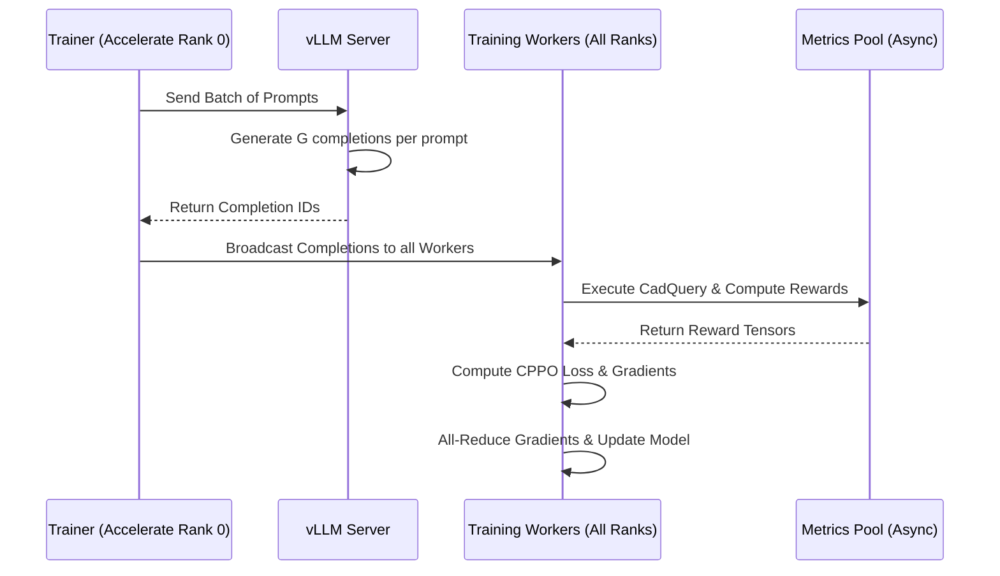

# Reinforcement Learning Theory

This document explains the current RL design implemented in this repo. `docs/design_doc.md` describes the architecture target; this page focuses on the behavior already present in the code and configs.

## Overview

The goal of RL in this project is to fine-tune a Vision-Language Model (VLM) to generate high-quality **CadQuery** code from visual inputs (rendered STLs). Unlike supervised fine-tuning (SFT), which minimizes token-level cross-entropy against a ground truth, RL optimizes for a non-differentiable **reward signal** derived from the execution of the generated code.

## The RL Loop

The training stack uses a variant of **Group Relative Policy Optimization (GRPO)** with a top-sample **CPPO** selection step.

```mermaid
graph TD
    Dataset[Dataset: Image + Prompt] --> Rollout[Rollout: Generate G completions]
    Rollout --> Execute[Execute CadQuery Code]
    Execute --> Reward[Compute Reward: IoU / Chamfer / AOC-GMS]
    Reward --> Advantage[Compute Group-Relative Advantages]
    Advantage --> TopK[Select Top-K Samples by |Advantage|]
    TopK --> Loss[Compute CPPO Loss]
    Loss --> Optimizer[Optimizer Step]
    Optimizer --> Dataset
```

### 1. Grouped Sampling (GRPO)
For each prompt in a batch, the model generates $G$ independent completions (rollouts). In this project, $G$ is typically set to 16.
The rewards $r_i$ for these $G$ completions are computed, and then normalized within the group to produce advantages $A_i$:

\[ A_i = \frac{r_i - \text{mean}(r)}{\text{std}(r) + \epsilon} \]

This group-relative approach removes the need for a separate value-function (critic) model, significantly reducing VRAM requirements.

### 2. Top-sample selection (CPPO variant)
To improve training stability and focus on the most informative samples, the frozen training core keeps a custom selection mechanism:
- We select the `top_samples` (e.g., 4 out of 16) that have the highest **absolute advantage**.
- These samples represent the "best" and "worst" performers relative to the group mean, providing the strongest gradient signal.

### 3. Reward function
The reward is the optimization target for the RL loop. The current configs expose reward settings through `train.reward_config`:
- **Execution Check**: If the code fails to execute or doesn't produce a valid mesh, it receives a `failure_reward` (e.g., -10 or 0).
- **Geometric Metrics**: If execution succeeds, we compute:
    - **IoU (Intersection over Union)**: Volumetric overlap between predicted and GT meshes.
    - **Chamfer Distance**: Point-cloud similarity.
    - **AOC-GMS**: Area Over the Curve of Global Multiview Similarity (surface normal alignment).
- **Mode selection**: the shipped configs cover constant-scheduler, cosine-scheduler, GMS-weighted, and AOC-GMS-weighted variants.

## Distributed Execution and vLLM

Generation is designed around vLLM-enabled training configs, with runtime and system settings controlling ports and environment setup.



### Key Implementation Details

- **Importance Sampling**: We support both `token` and `sequence` level importance sampling. `sequence` level averages the log-probability ratio over the completion length before applying the PPO clip.
- **Alignment**: `steps_per_generation` is aligned with `gradient_accumulation_steps` to ensure that the "old" log-probabilities used in the PPO ratio are consistent with the model version that generated them.
- **VLM Handling**: The trainer handles multimodal inputs (images + text) by passing pixel values and grid information through the rollout and loss computation phases.
- **Frozen core boundary**: the repo redesign keeps the algorithm math and reward semantics in a frozen core, while the config layer, run registry, and downstream scripts wrap that behavior with cleaner interfaces.

## Current config variants

The repo now expresses variants through stage configs under `configs/<experiment>/`.

In the checked-in demo tree, the active examples are:

- `configs/demo/common.yaml`
- `configs/demo/train.yaml`
- `configs/demo/infer.yaml`
- `configs/demo/build_meshes.yaml`
- `configs/demo/evaluate.yaml`
- `configs/demo/compare.yaml`

Scheduler and reward-weighting variants should be represented by editing or duplicating stage config files rather than reintroducing legacy `experiment.*` config names.
